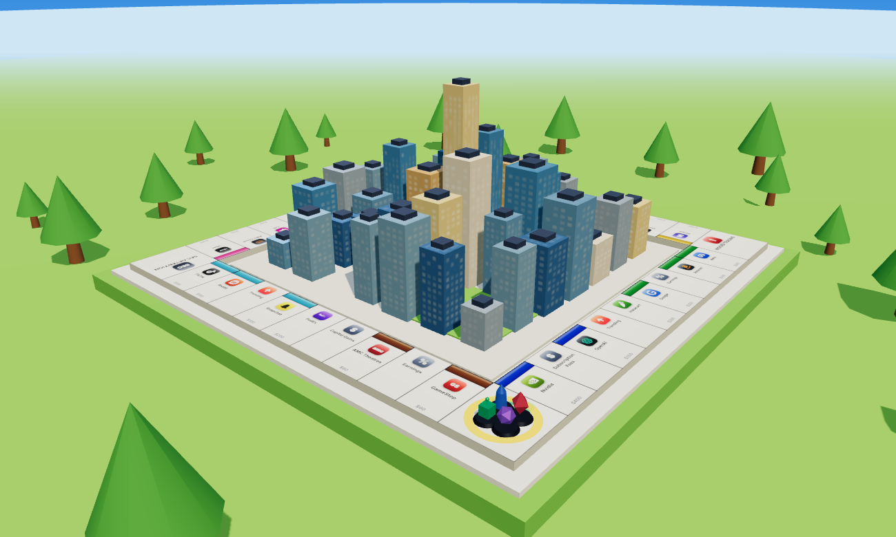

# 🏙️ Companyopoly

**The market is the board.** A 3D, browser-based property-trading board game where the spaces are today's biggest companies — meme stocks, social apps, gig platforms, streaming, fintech, Big Tech, and AI giants — rendered with real brand logos on a fully interactive WebGL board.

Built as a single self-contained `index.html` — no build step, no backend, no install. Just open it in a browser.



## Play

Open `index.html` in any modern browser, or serve the folder:

```bash
python -m http.server 3002
# then visit http://localhost:3002
```

> Needs an internet connection on first load — it pulls Three.js and brand logos from public CDNs. For a fully offline version, `classic.html` is a lightweight CSS-3D build with no external dependencies.

## Features

- **3D WebGL board** (Three.js) with modeled tiles, buildings, dice, and player tokens
- **A sunny "toy world"** — grassy island, drifting clouds, surrounding water, a city skyline rising from the board's center, warm lighting, and soft bloom
- **Floating player labels** above each token showing live name + cash
- **Title screen, options, and how-to-play** menus with auto-saved settings
- **1–4 players, pass-and-play** — humans and/or AI bots in any mix
- **AI opponents** that buy, build, auction, trade, mortgage, and manage debt on their own
- **Property trading** between players, with bots that evaluate offers
- **Auctions** when a property is declined
- **Mortgaging** for fast cash, plus build/sell management
- **Modifier cards** — Free Pass (get out of jail), advance-to, repairs, collect/pay each player, and more
- **Camera follow, floating money popups, count-up cash, and clickable tiles** to inspect any space
- **Synthesized sound effects and lo-fi background music** — generated in-browser, no audio files
- **Autosave & resume** — pick up an in-progress game from the title screen
- **Victory screen** with final standings (net worth, rent earned, companies owned)

## The board

| Sector | Companies |
| --- | --- |
| Meme Stocks | GameStop, AMC |
| Social Media | Snapchat, Reddit, TikTok |
| Gig Economy | Uber, Lyft, Airbnb |
| Streaming | Spotify, Twitch, Netflix |
| Food & Drink | Starbucks, Chipotle, McDonald's |
| Fintech | Robinhood, Coinbase, Stripe |
| Big Tech | Meta, Amazon, Google |
| AI Giants | OpenAI, Nvidia |

Plus delivery companies as the "railroads" (FedEx, UPS, DoorDash, Instacart) and cloud services as the "utilities" (AWS, Starlink).

## Tech

- [Three.js](https://threejs.org/) for 3D rendering (via CDN import map)
- [Simple Icons](https://simpleicons.org/) for brand logos (via CDN)
- Web Audio API for procedurally generated sound and music
- `localStorage` for settings and save games
- Vanilla JavaScript — no framework, no bundler

## Note on logos

This is a personal/hobby project. Company logos are trademarks of their respective owners and are loaded at runtime for parody/educational purposes. Don't use this commercially with the real marks.

## License

[MIT](LICENSE)
